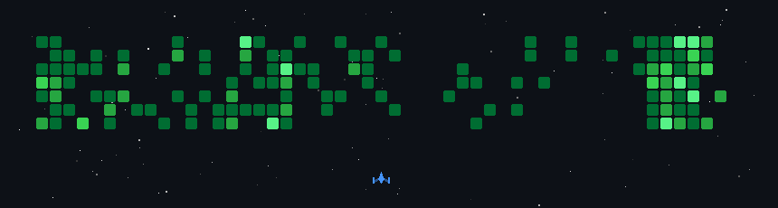
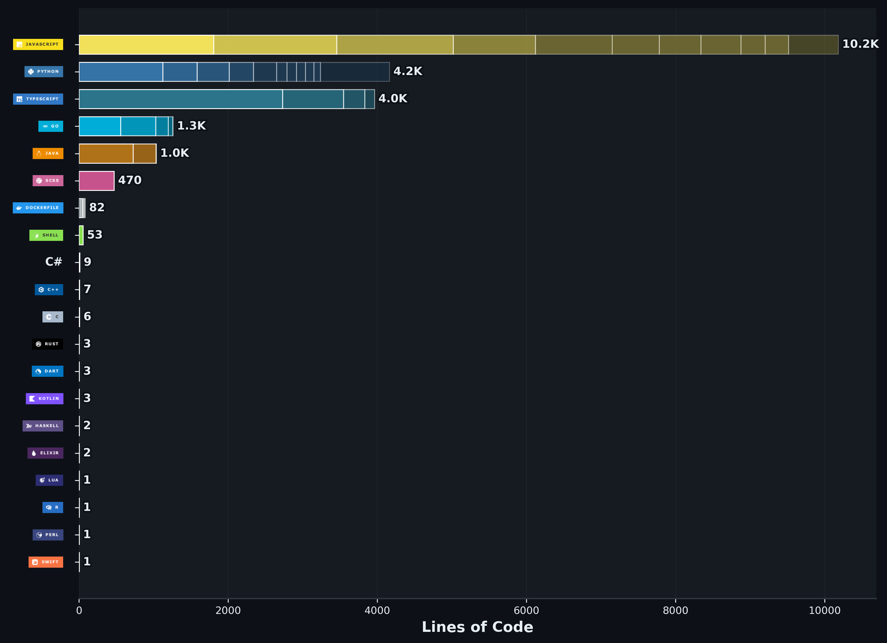

  <a href="https://x.com/aru_codes">X</a> •
  <a href="https://www.linkedin.com/in/anurup-bhowmick/">LinkedIn</a> •
  <a href="https://medium.com/@anurupbhowmick">Medium</a>

<!-- =========================
     TECH STACK
========================= -->
 

 

<h2 align="center">Crafted With ◈</h2>

### Languages

---

### Frontend

---

### Backend

---

### Databases & ORMs

---

### AI / ML

 

---

### Cloud & Research

---

### DevOps & Tools

---

### Design

---
<h2 align="center">GitHub Pulse ∿</h2>

  

<h2 align="center">Code DNA ⌬</h2>
<!-- language stats HTML -->

<h2 align="center">Digital Presence ◎</h2>

<!-- link style none -->

  
  
  
  

